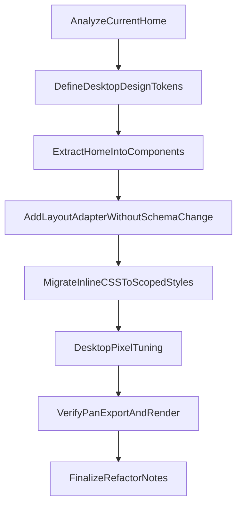

# Kế hoạch refactor UI toàn bộ app

## Mục tiêu
- Chuyển toàn bộ giao diện hiện tại sang phong cách ảnh mẫu (pixel-perfect ưu tiên desktop).
- Giữ nguyên data model/API đang dùng (`Person`, `familyTree`), chỉ thay đổi lớp hiển thị.
- Giảm rủi ro bằng refactor theo từng lớp nhỏ, kiểm thử sau mỗi thay đổi.

## Phạm vi kỹ thuật đã xác nhận
- Frontend runtime tập trung ở [D:/GIT/Gia-Pha-Ho-Doan/client/src/App.tsx](D:/GIT/Gia-Pha-Ho-Doan/client/src/App.tsx), [D:/GIT/Gia-Pha-Ho-Doan/client/src/pages/Home.tsx](D:/GIT/Gia-Pha-Ho-Doan/client/src/pages/Home.tsx), [D:/GIT/Gia-Pha-Ho-Doan/client/src/main.tsx](D:/GIT/Gia-Pha-Ho-Doan/client/src/main.tsx).
- Dữ liệu cây lấy từ [D:/GIT/Gia-Pha-Ho-Doan/client/src/data/familyTree.ts](D:/GIT/Gia-Pha-Ho-Doan/client/src/data/familyTree.ts).
- `Home.tsx` đang là monolith (render + interaction + CSS + export), là trọng tâm refactor.

## Kiến trúc refactor đề xuất
1. Tách `Home` thành các khối SRP rõ ràng:
   - `PosterShell` (khung tổng thể)
   - `PosterHeader` (tiêu đề + metadata)
   - `BranchSection` (từng nhánh)
   - `TreeRenderer`/`TreeNode`
   - `LegendPanel`
   - `Toolbar` (export, action)
2. Thêm lớp `layout adapter` để ánh xạ data hiện tại sang metadata hiển thị mà không đổi schema gốc.
3. Tách interaction thành custom hooks:
   - `useTreePan` (kéo/pan)
   - `usePosterExport` (xuất PNG)
4. Tách CSS khỏi `Home.tsx` thành hệ thống style theo token (spacing, border, typography) để đạt pixel tuning ổn định.

## Luồng triển khai

## Kế hoạch theo pha
- Pha 1: Baseline an toàn
  - Snapshot giao diện hiện tại, liệt kê khu vực bắt buộc giống ảnh mẫu.
  - Khoanh vùng CSS/JS trong `Home.tsx` theo từng block chức năng.
- Pha 2: Tách cấu trúc component
  - Tạo thư mục component mới cho gia phả (presentation only).
  - Di chuyển dần JSX từ `Home.tsx` sang component con, không đổi hành vi.
- Pha 3: Adapter + hooks
  - Đưa logic grouping/hardcode index vào adapter module riêng.
  - Tách pan/export sang hooks để UI thuần hiển thị.
- Pha 4: Pixel-perfect desktop
  - Áp design tokens, tune kích thước node, đường nối, khoảng cách nhánh theo ảnh mẫu.
  - Chuẩn hóa font/line-height/border-radius/shadow và xử lý overflow ngang desktop.
- Pha 5: Ổn định
  - Chạy kiểm thử smoke route `/`, drag-pan, export ảnh, không vỡ dữ liệu.
  - Dọn dead code và chuẩn hóa naming.

## Tiêu chí hoàn thành
- Trang `/` hiển thị bố cục desktop bám sát ảnh mẫu.
- Không đổi schema dữ liệu `familyTree` và không phá route hiện có.
- Tính năng pan và export PNG vẫn hoạt động.
- `Home.tsx` giảm đáng kể độ phức tạp, phần lớn UI nằm ở component/module riêng.

## Rủi ro chính và giảm thiểu
- Rủi ro lệch pixel do layout tree phụ thuộc text width:
  - Khống chế width node, quy tắc wrap text, token typography cố định.
- Rủi ro vỡ grouping nhánh do hardcode theo index:
  - Đưa toàn bộ grouping sang adapter có unit test mapping.
- Rủi ro regression tương tác:
  - Tách hooks và kiểm thử thủ công sau mỗi bước tách lớn.