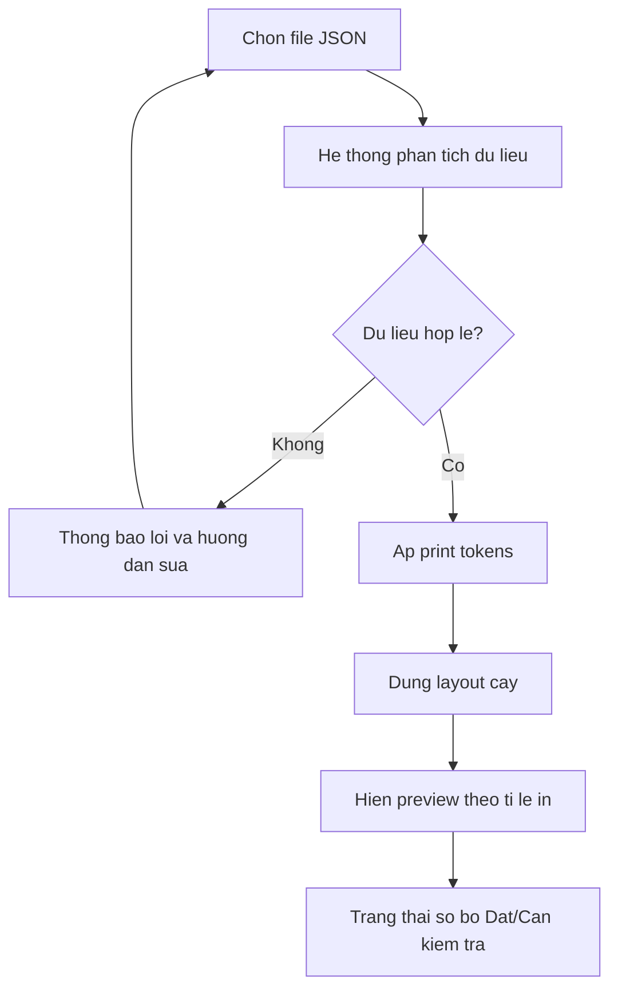
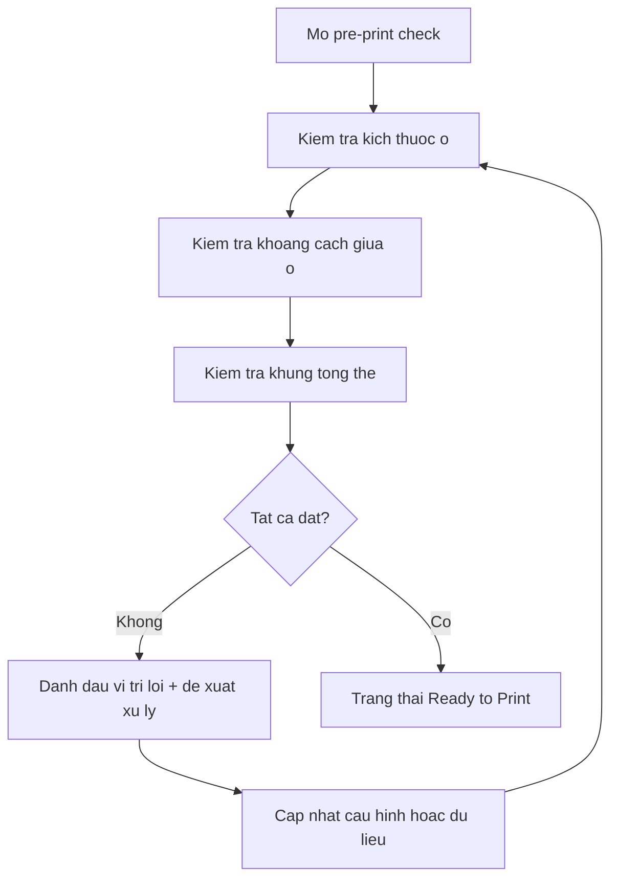
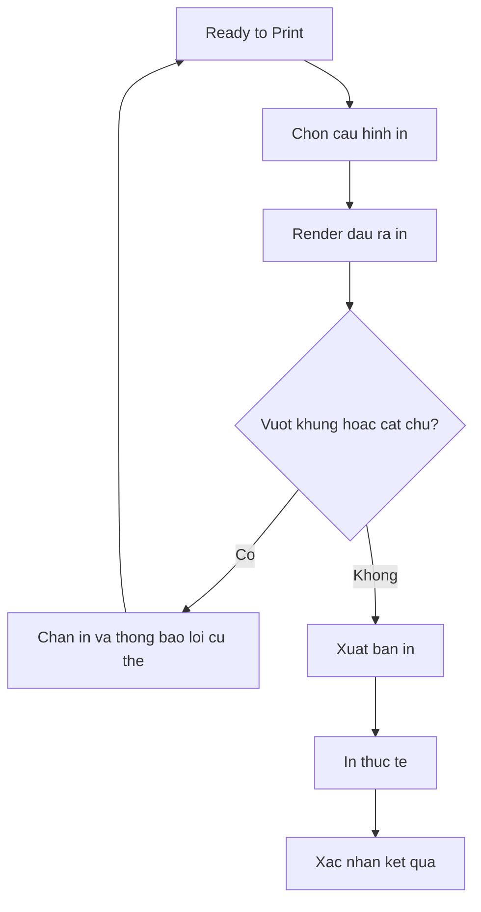

---
stepsCompleted:
  - 1
  - 2
  - 3
  - 4
  - 5
  - 6
  - 7
  - 8
  - 9
  - 10
  - 11
  - 12
  - 13
  - 14
lastStep: 14
inputDocuments:
  - d:/GIT/Gia-Pha-Ho-Doan/data/GiaPhaHoDoan.json
---

# UX Design Specification {{project_name}}

**Author:** {{user_name}}
**Date:** {{date}}

---

<!-- UX design content will be appended sequentially through collaborative workflow steps -->

## Executive Summary

### Project Vision

Xây dựng hệ thống gia phả số ưu tiên print-first để đảm bảo độ chính xác cực cao khi in ấn, giúp kích thước và bố cục ra giấy đúng với thiết kế. Hệ thống vẫn hỗ trợ xem trên máy tính/laptop/điện thoại, nhưng mục tiêu trọng tâm là bản in chuẩn xác, đẹp và dễ đọc.

### Target Users

Người dùng chính là thành viên dòng họ và người quản lý gia phả, đa phần không rành công nghệ (non-tech). Họ cần xem thông tin nhanh trên thiết bị số, nhưng hành vi cốt lõi là xuất và in bản gia phả hoàn chỉnh, rõ ràng, trang trọng.

### Key Design Challenges

- Kích thước thiết kế hiện tại chưa được tính toán chi tiết theo chuẩn in nên khó đảm bảo độ chính xác khi in thực tế.
- Cần hệ quy chiếu kích thước theo đơn vị vật lý để đảm bảo tính nhất quán giữa màn hình và bản in.
- Phải đồng thời tối ưu khả năng đọc trên desktop/laptop/mobile trong khi vẫn giữ ưu tiên in ấn.
- Cần mở rộng metadata dữ liệu để thêm thông tin ngày/tháng/năm mất mà không làm vỡ bố cục in.

### Design Opportunities

- Tạo lợi thế UX bằng độ chính xác in ấn cao, giúp người dùng tin cậy khi xuất bản gia phả.
- Áp dụng chiến lược print-first, responsive-second để cân bằng trải nghiệm đa thiết bị.
- Chuẩn hóa metadata nhân sự (bao gồm ngày/tháng/năm mất) nhằm tăng giá trị lưu trữ lịch sử và chất lượng hiển thị.
- Nâng trải nghiệm thẩm mỹ để tạo cảm giác "wow" từ cả bố cục lẫn chất lượng bản in.

## Core User Experience

### Defining Experience

Trải nghiệm cốt lõi tập trung vào hai hành động chính: xem preview trước khi in và in/xuất bản in với độ chính xác cao. Người dùng chuẩn bị dữ liệu JSON, hệ thống tự dựng layout để giảm tối đa thao tác chỉnh tay.

### Platform Strategy

Nền tảng được thiết kế theo hướng print-first, hỗ trợ đa thiết bị để xem trước và kiểm tra. Khổ in tổng thể mục tiêu vào khoảng 2.3m x 2.7m. Trên điện thoại ưu tiên nhu cầu xem nhanh, còn chỉnh sửa thực hiện trực tiếp trong dữ liệu JSON.

### Effortless Interactions

- Tự động dựng bố cục từ dữ liệu JSON.
- Tự động căn chỉnh để tiệm cận kích thước in mục tiêu.
- Tối giản thao tác thủ công trước khi in.

### Critical Success Moments

- Preview thể hiện rõ bố cục để người dùng tự tin trước khi in.
- Bản in đầu ra đạt độ chính xác cao so với kích thước mong muốn.
- Trải nghiệm bị xem là thất bại nếu kích thước in lệch đáng kể so với thiết kế kỳ vọng.

### Experience Principles

- Ưu tiên tuyệt đối độ chính xác in ấn.
- Nhất quán giữa preview và kết quả in thực tế.
- Tự động hóa cao, hạn chế chỉnh tay.
- Đa thiết bị để xem, chỉnh sửa tập trung ở nguồn dữ liệu.

## Desired Emotional Response

### Primary Emotional Goals

- Tin tưởng tuyệt đối rằng kích thước và bố cục khi in là chính xác.
- Yên tâm và có cảm giác kiểm soát trong suốt quá trình chuẩn bị in.
- Tự hào khi tạo ra bản gia phả in đẹp, trang trọng, rõ ràng.

### Emotional Journey Mapping

- Khi bắt đầu: cảm thấy dễ hiểu, không bị ngợp.
- Khi xem preview và chuẩn bị in: cảm thấy chắc chắn và tự tin.
- Sau khi in: cảm giác hài lòng vì kết quả đúng mong muốn.
- Khi phát sinh lỗi: nhận được hướng dẫn rõ ràng, giảm lo lắng.
- Khi quay lại sử dụng: quen thuộc, đáng tin, tiết kiệm thời gian.

### Micro-Emotions

- Cần tăng: tự tin, tin tưởng, hoàn thành, hài lòng.
- Cần giảm: bối rối, lo lắng, hoài nghi, khó chịu.

### Design Implications

- Xây dựng niềm tin bằng cách hiển thị rõ thông số và mức độ khớp giữa preview với bản in.
- Tăng tự tin bằng kiểm tra sớm các rủi ro lệch kích thước, tràn nội dung, cắt chữ.
- Tăng cảm giác hoàn thành bằng trạng thái xác nhận rõ ràng trước khi in.
- Giữ sự bình tĩnh bằng luồng thao tác ngắn gọn, ngôn ngữ đơn giản cho người non-tech.

### Emotional Design Principles

- Ưu tiên cảm giác chắc chắn hơn hiệu ứng phô diễn.
- Mọi quyết định UX phải củng cố niềm tin vào độ chính xác bản in.
- Giảm bất ngờ tiêu cực ở thời điểm in thực tế.
- Giữ phong cách trang trọng, phù hợp ngữ cảnh gia phả.

## UX Pattern Analysis & Inspiration

### Inspiring Products Analysis

Nguồn cảm hứng chính là trải nghiệm iPhone/iPad trong hệ sinh thái Apple, tập trung vào cảm giác sang trọng, rõ ràng và ổn định. Các đặc điểm nổi bật gồm tính nhất quán cao, phân cấp thông tin mạch lạc và giao diện tinh gọn ưu tiên nội dung.

### Transferable UX Patterns

- Phân cấp thị giác rõ ràng giữa thông tin chính và thông tin phụ để giảm tải nhận thức.
- Khoảng trắng có chủ đích để tạo cảm giác trang trọng và dễ đọc.
- Typography nhất quán, dễ đọc trên cả màn hình và bản in.
- Phản hồi trạng thái ngắn gọn, dễ hiểu, giúp người dùng non-tech tự tin thao tác.

### Anti-Patterns to Avoid

- Lạm dụng hiệu ứng thị giác khiến trải nghiệm mất tính trang trọng.
- Thiết kế dồn nén thông tin gây khó đọc khi in.
- Tư duy web-first làm giảm độ chính xác của đầu ra in.
- Bảng màu/độ tương phản thiếu kiểm soát làm chất lượng in không ổn định.

### Design Inspiration Strategy

**What to Adopt**

- Tinh thần tối giản cao cấp, tập trung nội dung, tránh nhiễu.
- Tính nhất quán hệ thống giữa các trạng thái xem trước, kiểm tra và in.

**What to Adapt**

- Chuyển hóa phong cách Apple theo định hướng print-first của dự án.
- Điều chỉnh mật độ thông tin để phù hợp dữ liệu gia phả nhiều thế hệ.

**What to Avoid**

- Các pattern đẹp trên màn hình nhưng làm giảm độ chính xác in ấn.
- Các lựa chọn đòi hỏi người dùng phải tinh chỉnh thủ công quá nhiều.

## Design System Foundation

### 1.1 Design System Choice

Chọn hướng Custom Design System theo chiến lược print-first, kết hợp ngôn ngữ thị giác lấy cảm hứng từ iPhone/iPad để giữ sự sang trọng, rõ ràng và nhất quán.

### Rationale for Selection

- Dự án yêu cầu độ chính xác in ấn cực cao nên cần kiểm soát chặt đơn vị vật lý và quy tắc layout.
- Người dùng chính non-tech nên cần hệ giao diện đơn giản, dễ hiểu, ít thao tác.
- Phong cách Apple phù hợp mục tiêu thẩm mỹ cao cấp và cảm giác tin cậy.
- Dữ liệu gia phả nhiều cấp, tên dài và tiếng Việt có dấu cần quy chuẩn hiển thị riêng.

### Implementation Approach

- Xây dựng design tokens print-first (kích thước ô, khoảng cách, typography, lề) theo chuẩn in.
- Tách lớp preview đa thiết bị và lớp in để đảm bảo tính nhất quán từ màn hình ra giấy.
- Chuẩn hóa bộ component cốt lõi cho node, connector, trạng thái kiểm tra trước in.
- Thiết kế cơ chế kiểm tra tự động trước in để giảm rủi ro lệch kích thước và tràn nội dung.

### Customization Strategy

- Giữ tinh thần tối giản cao cấp, ưu tiên khả năng đọc và tính trang trọng.
- Hỗ trợ tùy biến theo đời thông qua token mà vẫn đảm bảo nhất quán toàn hệ.
- Mở rộng metadata (bao gồm ngày/tháng/năm mất) theo quy tắc hiển thị thống nhất.
- Giảm tối đa nhu cầu chỉnh tay bằng tự động hóa layout và xác thực trước in.

## 2. Core User Experience

### 2.1 Defining Experience

Trải nghiệm định danh của sản phẩm là xem preview chuẩn in và xuất bản in chính xác cao mà không cần tinh chỉnh thủ công phức tạp. Người dùng chỉ cần chuẩn bị dữ liệu JSON, hệ thống tự dàn bố cục và hướng dẫn hoàn tất quy trình in.

### 2.2 User Mental Model

- Người dùng tiếp cận theo luồng quen thuộc: chuẩn bị dữ liệu, xem trước, in, kiểm tra.
- Kỳ vọng chính là những gì thấy trên preview phải khớp bản in thực tế.
- Người dùng non-tech mong hệ thống xử lý phần kỹ thuật thay vì bắt buộc tự tinh chỉnh sâu.
- Điểm dễ gây khó chịu là sai lệch kích thước, tràn chữ, hoặc vỡ bố cục khi in khổ lớn.

### 2.3 Success Criteria

- Preview thể hiện rõ cấu trúc nhánh và mức độ đọc tốt ở khổ in mục tiêu.
- Sai lệch kích thước đầu ra được giữ trong ngưỡng chấp nhận.
- Nội dung quan trọng không bị cắt chữ hoặc rối bố cục.
- Quy trình có trạng thái xác nhận rõ ràng trước khi in.

### 2.4 Novel UX Patterns

- Ưu tiên pattern quen thuộc (preview, zoom/pan, trạng thái kiểm tra) để giảm học sử dụng.
- Sáng tạo ở lớp tự động hóa print-first thay vì tạo thao tác mới khó học.
- Kết hợp pattern quen thuộc với kiểm tra chất lượng in chuyên sâu để tạo khác biệt.

### 2.5 Experience Mechanics

**1. Initiation**

- Người dùng nạp dữ liệu JSON gia phả.
- Hệ thống áp cấu hình khổ in mục tiêu.

**2. Interaction**

- Hệ thống tự dựng layout theo bộ token print-first.
- Người dùng xem preview và kiểm tra các vùng thông tin quan trọng.

**3. Feedback**

- Hệ thống hiển thị trạng thái đạt/chưa đạt cho tiêu chí in.
- Nếu có lỗi, chỉ rõ nguyên nhân và gợi ý xử lý ngắn gọn.

**4. Completion**

- Khi đạt điều kiện, hệ thống xác nhận sẵn sàng in.
- Người dùng thực hiện xuất/in với mức tin cậy cao vào kết quả.

## Visual Design Foundation

### Color System

- Định hướng màu sắc sang trọng, tối giản và ổn định theo tinh thần Apple-inspired.
- Ưu tiên bảng màu trung tính có điểm nhấn rõ ràng để tăng cảm giác trang trọng.
- Màu trạng thái (thành công/cảnh báo/lỗi) dùng tiết chế, tập trung vào khả năng đọc khi in.
- Đảm bảo màu trên màn hình chuyển đổi tốt sang bản in, tránh phụ thuộc sắc độ quá nhẹ.

### Typography System

- Ưu tiên font dễ đọc, hỗ trợ tiếng Việt tốt, phù hợp cả preview và bản in.
- Thiết lập thang chữ rõ ràng cho tiêu đề, nội dung chính, thông tin phụ và metadata.
- Duy trì tương phản chữ/nền đủ cao để đảm bảo đọc tốt với người dùng non-tech.
- Cân bằng tính thẩm mỹ cao cấp với yêu cầu nhận diện thông tin nhanh.

### Spacing & Layout Foundation

- Lấy print-first làm chuẩn để xác lập hệ spacing và layout thống nhất.
- Kích thước ô mặc định: 1.5cm x 12cm.
- Khoảng cách giữa các ô: 0.25cm.
- Cho phép mở rộng token kích thước cho đời 1-4 ở giai đoạn sau mà vẫn giữ nhất quán hệ thống.
- Khoảng trắng được tổ chức có chủ đích để giảm rối khi hiển thị cây lớn nhiều thế hệ.

### Accessibility Considerations

- Ưu tiên độ rõ ràng hơn hiệu ứng thị giác để giảm tải nhận thức.
- Không dùng màu làm tín hiệu duy nhất cho trạng thái.
- Bảo đảm khả năng đọc tốt trên desktop/laptop/mobile và khi in.
- Giữ luồng thông tin đơn giản, nhất quán, dễ hiểu cho người dùng không chuyên kỹ thuật.

## Design Direction Decision

### Design Directions Explored

Đã khám phá nhiều hướng trực quan với trọng tâm print-first, bao gồm các phương án thiên về thẩm mỹ tối giản, mật độ thông tin, độ an toàn in đơn sắc và cơ chế xác thực trước in.

### Chosen Direction

Chọn hướng kết hợp: nền thị giác tối giản kiểu Apple-inspired và cơ chế validation-first trước khi in. Trọng tâm cao nhất là kiểm soát kích thước ô, khoảng cách giữa ô và kích thước tổng thể bản in để đảm bảo đầu ra chuẩn xác.

### Design Rationale

- Nhu cầu cốt lõi là độ chính xác in ấn, không phải hiệu ứng trực quan.
- Cần một hướng thiết kế vừa sang trọng, dễ đọc, vừa có cơ chế kiểm chứng chất lượng trước in.
- Kết hợp này phù hợp với người dùng non-tech vì giảm quyết định kỹ thuật thủ công.
- Đáp ứng ưu tiên chính: kích thước từng ô, khoảng cách giữa ô, và khung in tổng thể.

### Implementation Approach

- Thiết lập bộ print tokens làm nguồn sự thật cho kích thước ô, khoảng cách và khổ tổng thể.
- Duy trì preview theo đúng tỉ lệ token để giảm sai lệch giữa màn hình và bản in.
- Áp dụng pre-print validation để kiểm tra sai lệch kích thước, tràn chữ và vượt khung in.
- Chuẩn hóa quy trình in theo các mốc: dựng layout, kiểm tra chất lượng, xác nhận sẵn sàng in, xuất bản in.

## User Journey Flows

### Journey 1: Nạp dữ liệu và dựng preview chuẩn in

Mục tiêu: từ dữ liệu JSON tạo ngay preview đúng tỷ lệ in để người dùng kiểm tra nhanh tính khả thi.

### Journey 2: Kiểm tra chất lượng trước in

Mục tiêu: đảm bảo kích thước ô, khoảng cách và khung tổng thể đạt chuẩn trước khi xuất in.

### Journey 3: Xuất bản in

Mục tiêu: tạo đầu ra in đúng thông số đã xác nhận, giảm tối đa rủi ro sai lệch thực tế.

### Journey Patterns

- Luôn có vòng lặp kiểm tra và hiệu chỉnh trước khi in chính thức.
- Trạng thái hệ thống được chuẩn hóa rõ ràng: Chưa đạt, Cần kiểm tra, Ready to Print.
- Lỗi phải đi kèm nguyên nhân và vị trí cụ thể để người dùng sửa nhanh.
- Luồng thao tác ưu tiên ít bước, giảm quyết định kỹ thuật cho người dùng non-tech.

### Flow Optimization Principles

- Ưu tiên độ chính xác in hơn tốc độ thao tác bề mặt.
- Giảm tải nhận thức bằng từng bước rõ mục tiêu và phản hồi ngay lập tức.
- Tự động hóa tối đa những quyết định kỹ thuật lặp lại.
- Không cho phép xuất in khi chưa qua validation cứng về kích thước và bố cục.

## Component Strategy

### Design System Components

Các thành phần nền tảng tái sử dụng từ hệ thiết kế gồm button, input, select, panel, modal, badge trạng thái và thông báo lỗi. Các thành phần này đảm bảo luồng thao tác nhất quán và dễ học cho người dùng non-tech.

### Custom Components

**1) TreeNodePrint**

- Purpose: hiển thị một cá nhân trong cây theo quy chuẩn kích thước in.
- Content: họ tên, metadata cốt lõi, ngày/tháng/năm mất.
- States: mặc định, chọn, cảnh báo tràn nội dung, lỗi in.
- Variants: phiên bản chuẩn và phiên bản mở rộng cho các đời ưu tiên.

**2) TreeConnector**

- Purpose: thể hiện quan hệ nhánh trong cây gia phả.
- States: mặc định, tô sáng, cảnh báo giao cắt khó đọc.
- Interaction: giữ đường đọc rõ ràng khi cây nhiều thế hệ.

**3) PrintCanvasFrame**

- Purpose: quản lý khung tổng thể bản in theo thông số mục tiêu.
- Behavior: phản ánh đúng tỷ lệ token trên preview, cảnh báo vượt khung.
- States: đạt chuẩn, vượt ngang, vượt dọc.

**4) PrePrintValidationPanel**

- Purpose: tổng hợp kiểm tra trước in.
- Checks: kích thước ô, khoảng cách ô, khung tổng thể, tràn hoặc cắt chữ.
- States: pass, warning, fail kèm hướng dẫn xử lý cụ thể.

**5) TokenConfigPanel**

- Purpose: cấu hình token in cho kích thước và spacing.
- Behavior: cập nhật preview theo thời gian thực.
- Constraint: chặn giá trị phá vỡ tỷ lệ và tiêu chuẩn in.

### Component Implementation Strategy

- Xây custom components dựa trên print tokens làm nguồn sự thật duy nhất.
- Đồng bộ giữa lớp preview và lớp in để giảm sai lệch đầu ra.
- Chuẩn hóa trạng thái lỗi và thông điệp để hỗ trợ xử lý nhanh.
- Ưu tiên khả năng tái sử dụng cho các mẫu tương tác lặp lại.

### Implementation Roadmap

**Phase 1 - Core Print Accuracy**

- TreeNodePrint
- PrintCanvasFrame
- PrePrintValidationPanel

**Phase 2 - Structure & Navigation**

- TreeConnector
- Hệ trạng thái kiểm tra và chỉ báo chất lượng

**Phase 3 - Productivity & Refinement**

- TokenConfigPanel
- Tối ưu metadata và cảnh báo nâng cao

## UX Consistency Patterns

### Button Hierarchy

- Primary button chỉ dùng cho hành động chính theo từng bước in.
- Secondary button dành cho thao tác hỗ trợ và điều hướng phụ.
- Danger button chỉ áp dụng cho hành động phá hủy, luôn kèm xác nhận.
- Thứ bậc trực quan nút giữ nhất quán giữa desktop, laptop và mobile.

### Feedback Patterns

- Chuẩn hóa trạng thái: Pass, Warning, Fail cho toàn bộ luồng kiểm tra in.
- Mỗi lỗi phải có nguyên nhân, vị trí và hướng xử lý cụ thể.
- Không dùng màu làm tín hiệu duy nhất; luôn kèm nhãn hoặc biểu tượng.
- Phản hồi phải xuất hiện đúng thời điểm để tránh sai sót dây chuyền.

### Form Patterns

- Form cấu hình bắt buộc hiển thị đơn vị rõ ràng theo cm cho kích thước và spacing.
- Validation theo thời gian thực, chặn đầu vào vượt chuẩn in.
- Nhãn trường ngắn gọn, ngôn ngữ đơn giản cho người dùng non-tech.
- Giữ cấu trúc form ổn định để người dùng dễ học và thao tác lặp lại.

### Navigation Patterns

- Điều hướng theo step tuyến tính: nạp dữ liệu, preview, kiểm tra, xuất in.
- Không cho bỏ qua bước validation cứng trước khi xuất.
- Cho phép quay lại bước trước để chỉnh, nhưng phải tái kiểm tra sau khi thay đổi.
- Trạng thái tiến trình luôn hiển thị rõ để giảm cảm giác mất phương hướng.

### Additional Patterns

- Modal xác nhận cho thao tác ảnh hưởng trực tiếp tới đầu ra in.
- Empty state có hướng dẫn rõ ràng khi chưa có dữ liệu hoặc cấu hình.
- Loading state hiển thị tiến trình để người dùng biết hệ thống đang xử lý.
- Search/filter ưu tiên truy xuất nhanh mà không phá vỡ mạch đọc của cây.
- Print gate pattern: khóa xuất in khi còn lỗi kích thước, spacing hoặc khung tổng thể.

## Responsive Design & Accessibility

### Responsive Strategy

- Desktop/laptop là nền tảng chính cho luồng chuẩn bị và xuất in.
- Tablet ưu tiên xem preview và thao tác chạm với bố cục đơn giản hóa.
- Mobile tập trung nhu cầu xem nhanh trạng thái và thông tin cốt lõi.
- Luồng in chuẩn vẫn bám theo trải nghiệm desktop-first để đảm bảo độ chính xác.

### Breakpoint Strategy

- Mobile: 320-767.
- Tablet: 768-1023.
- Desktop: 1024+.
- Có thể mở rộng breakpoint cho màn hình lớn để hiển thị tốt cây gia phả khổ rộng.
- Áp dụng chiến lược desktop-first cho nghiệp vụ in, responsive adaptation cho thiết bị nhỏ.

### Accessibility Strategy

- Mục tiêu tuân thủ WCAG AA cho trải nghiệm thực dụng và bền vững.
- Đảm bảo tương phản đủ cao cho chữ và trạng thái.
- Hỗ trợ điều hướng bàn phím cho các thao tác chính.
- Cung cấp nhãn rõ ràng cho trạng thái pass/warning/fail.
- Không dựa vào màu đơn lẻ để truyền đạt thông tin quan trọng.

### Testing Strategy

- Kiểm thử responsive trên desktop, laptop, tablet và mobile thực tế.
- Kiểm thử đa trình duyệt cho các luồng cốt lõi.
- Kiểm thử accessibility bằng công cụ tự động và thao tác bàn phím.
- Kiểm thử print fidelity giữa preview và bản in thực tế.
- Chạy regression checklist sau mỗi thay đổi token ảnh hưởng layout in.

### Implementation Guidelines

- Tách rõ lớp preview tương tác và lớp render in chuẩn.
- Dùng print tokens làm nguồn sự thật duy nhất cho kích thước.
- Dùng cấu trúc ngữ nghĩa và nhãn trạng thái rõ ràng để hỗ trợ accessibility.
- Tối ưu hiệu năng cho cây lớn khi zoom/pan trên thiết bị khác nhau.
- Chỉ cho xuất in khi vượt qua toàn bộ validation cứng.
