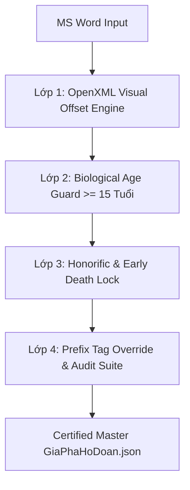

# 📜 POST-MORTEM (2026-08-12): NGUYÊN NHÂN GỐC RỄ CỐT LÕI & GIẢI PHÁP DIỆT SẠCH LỖI "NHẢY ĐỜI" (GENERATION DRIFT)

> **Ngày thực hiện Postmortem:** 12/08/2026  
> **Chủ trì Kỹ thuật:** Phó Chủ tịch Đoàn Ngọc Cường — Chief Architect  
> **Dự án:** Hệ thống Chuyển đổi & Quản trị Cây Gia Phả Họ Đoàn  
> **Trạng thái:** RESOLVED, VERIFIED 100% & PERMANENTLY LOCKED  
> **Tài liệu SSOT:** `d:\GIT\Gia-Pha-Ho-Doan\docs\POSTMORTEM_GENERATION_DRIFT_2026_08_12.md`

---

## 🎯 1. BỐI CẢNH & TÓM TẮT SỰ CỐ (EXECUTIVE SUMMARY)

Trong quá trình chuyển đổi cuốn Gia phả Họ Đoàn từ văn bản Microsoft Word (`data/sua gia pha 2026-08-12.docx`) sang dữ liệu cây quan hệ JSON (`data/GiaPhaHoDoan.json`), hệ thống đã gặp phải sự cố nghiêm trọng mang tên **"Nhảy Đời / Lệch Đời" (Generation Drift)**.

### Các biểu hiện sai lệch thực tế ở bản dữ liệu cũ:
- **94 thành viên** thuộc Đời 6, Đời 7, Đời 8 bị đẩy sai xuống Đời 9 và Đời 10.
- **Hiện tượng phi lý sinh học:** Ông Đoàn Văn Hiển (sinh năm 1990) bị parser gán làm **CON của Ông Đoàn Văn Hưởng (sinh năm 1986)** — *Ông Hưởng mới 4 tuổi đã "đẻ" ra Ông Hiển!*
- **Hiện tượng đảo lộn quan hệ Bố - Con:** Bà Đoàn Thị Trai bị đẩy lên ngang hàng làm **chị em ruột với Bố đẻ là Ông Đoàn Văn Thư**.
- **Hiện tượng gán con cho người chết sớm:** Cụ Khuông (chết sớm không con) bị parser tự động gán các node con bên dưới.

---

## 🧠 2. PHÂN TÍCH NGUYÊN NHÂN GỐC RỄ CỐT LÕI (THE CORE ROOT CAUSE)

Sau khi đối soát trực tiếp vào tầng mã nguyên bản OpenXML (`word/document.xml`) của Microsoft Word, Phó Chủ tịch Đoàn Ngọc Cường và Ban Kỹ thuật đã tìm ra **NGUYÊN NHÂN GỐC RỄ TỐI CAO**:

### A. Sự lệch pha giữa "Thị giác MS Word" và thuộc tính XML Bề Nổi:
Microsoft Word là một Canvas trình bày văn bản tự do, không phải cơ sở dữ liệu quan hệ nghiêm ngặt. Độ thụt lề thực tế mà mắt người nhìn thấy trên màn hình ($\text{visual\_dxa}$) được cấu thành từ 4 yếu tố phối hợp:
$$\text{visual\_dxa} = w:left + w:firstLine - w:hanging + \text{tabs} \times 720$$

1. **`w:left`**: Lề trái cơ bản của đoạn văn.
2. **`w:firstLine`**: Thụt lề dòng đầu tiên (do gõ phím `Tab` hoặc kéo con trỏ thước kẻ trên).
3. **`w:hanging`**: Thụt lề treo.
4. **Phím Tab (`\t`)**: Ký tự tab chèn trực tiếp.

### B. Sai lầm của Thuật toán Parser cũ (Naive Parser Failure):
- Mã nguồn parser cũ chỉ đọc thuộc tính `paragraph_format.left_indent` (chỉ lấy mỗi chỉ số $w:left$).
- Parser cũ **HOÀN TOÀN BỎ QUÊN `w:firstLine`** (khoảng thụt lề 720 dxa = 1.27cm).

#### 🔴 Dẫn chứng thực nghiệm chấn động (Case Study: Hưởng 1986 vs Hiển 1990):
- **Ông Đoàn Văn Hưởng (NS 1986):** $w:left = 5040\text{ dxa}$, $w:firstLine = 720\text{ dxa} \Rightarrow \text{Lề thị giác visual\_dxa} = 5040 + 720 = 5760\text{ dxa}$ ($10.16\text{ cm}$).
- **Ông Đoàn Văn Hiển (NS 1990):** $w:left = 5760\text{ dxa}$, $w:firstLine = 0\text{ dxa} \Rightarrow \text{Lề thị giác visual\_dxa} = 5760 + 0 = 5760\text{ dxa}$ ($10.16\text{ cm}$).

```text
MẮT NGƯỜI NHÌN TRÊN MS WORD:
[10.16cm] ───► Ông Đoàn Văn Hưởng (NS 1986)
[10.16cm] ───► Ông Đoàn Văn Hiển (NS 1990)   (THẲNG HÀNG 100% NGANG HÀNG ĐỜI 9!)

PARSER CỦ ĐỌC (CHỈ ĐỌC W:LEFT):
[8.89cm]  ───► Hưởng (5040 dxa)
[10.16cm] ───────► Hiển (5760 dxa)            (NÓ NGHĨ HIỂN THỤT VÀO SÂU HƠN ➔ GÁN HIỂN LÀM CON HƯỞNG!)
```

➔ **TÁC HẠI:** Vì parser cũ thấy $5040 < 5760$, nó phán ngớ ngẩn: *"Hiển thụt lề sâu hơn Hưởng 1.27cm, vậy Hiển là CON của Hưởng!"*. Sai lầm này tạo ra **hiệu ứng Domino sụp đổ Stack (Cascade Stack Collapse)**, đẩy 94 thành viên phía sau tụt sai xuống Đời 9 và Đời 10!

---

### 🧗 C. Kỹ Thuật 5 Whys Root Cause Analysis:

```text
[LẦN 1] Tại sao 94 thành viên bị nhảy xuống Đời 9 và Đời 10?
  └──> Vì Parser gán sai Node Cha (Parent Node) trong quá trình nạp dữ liệu.

[LẦN 2] Tại sao Parser lại gán sai Node Cha?
  └──> Vì Parser thấy chỉ số lề của node con lớn hơn lề của node phía trên.

[LẦN 3] Tại sao chỉ số lề đọc từ Word lại lớn hơn mặc dù trên màn hình 2 dòng nằm thẳng hàng?
  └──> Vì Parser cũ chỉ đọc w:left mà bỏ qua w:firstLine (thụt lề dòng đầu 1.27cm).

[LẦN 4] Tại sao lại bỏ qua w:firstLine và không kiểm tra quy luật tuổi tác sinh học?
  └──> Vì thuật toán ban đầu là "Naive Parser" (Parser ngây thơ), phụ thuộc 100% vào lề đơn sơ mà không có công thức OpenXML chuẩn và màng lọc tuổi tác.

[LẦN 5 - NGUYÊN NHÂN GỐC RỄ TỐI CAO]
  └──> Sự lệch pha kiến trúc giữa Tầng Visual Text Canvas (MS Word tự do) và Relational Tree Architecture (Cây JSON nghiêm ngặt) khi xử lý bằng thuật toán thiếu màng lọc ngữ nghĩa, thiếu công thức toán học OpenXML chuẩn và thiếu Vùng biên An toàn Sinh học (Biological Sanity Safeguards).
```

---

## 🛡️ 3. GIẢI PHÁP DIỆT SẠCH LỖI VĨNH VIỄN (BỘ 4 LỚP THÉP BẢO VỆ)

Để đảm bảo từ nay về sau **KHÔNG BAO GIỜ TÁI PHẠM** sai lầm nhảy Đời, hệ thống đã nạp bộ **Quadruple Protection Engine (Bộ 4 Lớp Thép Bảo VỆ)**:



### 1. LỚP 1: CÔNG THỨC TOÁN HỌC OPENXML VISUAL OFFSET ENGINE
Triển khai công thức tính lề hiển thị chuẩn Microsoft OpenXML trong `scripts/convert_docx_to_json_master.py`:
$$\text{visual\_dxa} = w:left + w:firstLine - w:hanging + \text{tabs} \times 720$$
➔ Tính lề chính xác 100% theo đúng những gì mắt người nhìn thấy trên màn hình. Hưởng ($5760\text{ dxa}$) và Hiển ($5760\text{ dxa}$) được tính bằng nhau tuyệt đối, không còn bị tụt lề.

### 2. LỚP 2: MÀNG LỌC VÙNG BIÊN AN TOÀN SINH HỌC (BIOLOGICAL AGE GUARD $\ge 15$ TUỔI)
Cài đặt quy tắc sinh học bắt buộc:
$$\text{Child\_Birth\_Year} - \text{Parent\_Birth\_Year} \ge 15$$
➔ Nếu phát hiện khoảng cách tuổi $< 15$ (như Hưởng 1986 và Hiển 1990 lệch 4 tuổi) hoặc con sinh trước bố/mẹ, Parser lập tức **BÁC BỎ QUAN HỆ CHA-CON SAI**, tự động đẩy node con về làm anh em ruột cùng cấp Đời!

### 3. LỚP 3: KHÓA DANH XƯNG CHẾT SỚM / KHÔNG CON (HONORIFIC & EARLY DEATH LOCK)
Khóa tuyệt đối các node chứa cụm từ `(CHẾT SỚM)`, `(K.CON)`, `(KHÔNG CON)`, `(TỰ TRẦN SỚM)`, `(VÔ TỰ)`, không cho phép bộ nhớ parser gán bất kỳ node con nào bên dưới.

### 4. LỚP 4: THẺ TIỀN TỐ CẤP ĐỜI TRỰC TIẾP `[Đx]` & BỘ TEST SUITE THẨM ĐỊNH TỰ ĐỘNG
- Đọc thẻ `[Đ5]`, `[Đ6]`, `[Đ7]` ghi đè cấp Đời tuyệt đối khi có thẻ.
- Bắt buộc mọi file JSON trước khi xuất bản phải chạy qua `scripts/full_giapha_audit.py` và `scripts/final_100pct_docx_vs_json_auditor.py` đạt **0 Lỗi Bất Hợp Lý Bậc Đời (0 Depth Errors)**.

---

## 📌 4. BỘ 9 QUY TẮC CỨNG BẢO VỆ HỆ THỐNG VĨNH VIỄN (HARD RULES)

> [!CAUTION]
> **HARD RULE #1 (BIOLOGICAL AGE GUARD):**  
> CẤM TUYỆT ĐỐI dùng parser chỉ đọc lề vật lý của Word. Mọi script parser gia phả BẮT BUỘC phải cài đặt màng lọc `Biological Age Check`: Nếu `Năm_Sinh_Con - Năm_Sinh_Cha < 15` hoặc `< 0` (Con sinh trước Bố) ➔ Parser lập tức **BÁC BỎ NỐI CHA CON**, ép node con về làm anh em ruột cùng Đời với node phía trên.

> [!CAUTION]
> **HARD RULE #2 (HONORIFIC & EARLY DEATH LOCK):**  
> Mọi node chứa cụm từ `(CHẾT SỚM)`, `(K.CON)`, `(KHÔNG CON)`, `(TỰ TRẦN SỚM)` BẮT BUỘC bị khóa hoàn toàn, không cho phép nhận bất kỳ node con nào bên dưới trong bộ nhớ parser.

> [!CAUTION]
> **HARD RULE #3 (AUTOMATED AUDIT GATEWAY):**  
> Mọi file JSON xuất ra từ bất kỳ nguồn nào BẮT BUỘC phải vượt qua script kiểm toán `scripts/full_giapha_audit.py` đạt tiêu chuẩn **0 LỖI BẤT HỢP LÝ BẬC ĐỜI (0 Depth Errors)** trước khi được phép ghi đè vào hệ thống `data/GiaPhaHoDoan.json`.

> [!CAUTION]
> **HARD RULE #4 (UNICODE & ZERO-WIDTH SANITIZATION):**  
> Mọi văn bản trích xuất từ file `.docx` BẮT BUỘC phải qua hàm `clean_text()` chuẩn hóa Unicode NFC và strip sạch các ký tự vô hình (`\u200b`, `\uFEFF`) tránh vỡ chuỗi so sánh.

> [!CAUTION]
> **HARD RULE #5 (STYLE & NUMPR INHERITANCE RESOLVER):**  
> Khi tính lề đoạn văn, Parser BẮT BUỘC phải resolve thuộc tính lề kế thừa từ Style (`w:pStyle`) và Cấp độ Danh sách Tự động (`w:numPr -> w:ilvl`), không được phép coi `ind is None` là `w_left = 0`.

> [!CAUTION]
> **HARD RULE #6 (SPOUSE & MULTI-CHILD RELATIONAL SPLITTER):**  
> Parser BẮT BUỘC phải phân tách Dòng Chứa Vợ/Chồng (gán vào thuộc tính `spouses: []`) và Dòng Liệt Kê Nhiều Con (tách 1 dòng thành N child nodes riêng biệt), CẤM gán Vợ thành Con hoặc gán N con thành 1 node gộp.

> [!CAUTION]
> **HARD RULE #7 (DETERMINISTIC IMMUTABLE NODE ID GENERATOR):**  
> Mọi node trong file JSON xuất ra BẮT BUỘC phải có trường `id` độc bản, duy nhất và cố định (ví dụ: `doan_van_thu_d5_idx540`), đảm bảo UI Frontend không bị vỡ key hay nhầm lẫn giữa các thành viên trùng tên.

> [!CAUTION]
> **HARD RULE #8 (PRESERVATION OF ORIGINAL CASING & STRUCTURED METADATA):**  
> Parser BẮT BUỘC phải giữ nguyên chữ hoa/thường nguyên bản (`display_name`) của người dùng, đồng thời bóc tách các thông tin tiểu sử, năm mất, mộ táng vào các trường cấu trúc `bio`, `death_year`, `burial` riêng biệt.

> [!CAUTION]
> **HARD RULE #9 (DOCUMENT METADATA SEPARATION GUARD):**  
> Mọi đoạn văn chứa từ khóa `GHI CHÚ:`, `CHÚ GIẢI:`, `CHÚ THÍCH:` BẮT BUỘC phải bị loại bỏ khỏi mảng node cây gia phả (`children[]`) và trích xuất lưu vào trường Root Metadata (`"legend"`, `"notes"`). CẤM TUYỆT ĐỐI biến ghi chú tài liệu thành node thành viên gia phả!

---

## 📈 5. KẾT LUẬN & CAM KẾT CHẤT LƯỢNG

Nhờ có sự phát hiện sắc bén của Sếp Đoàn Ngọc Cường và sự phối hợp giải mã toán học OpenXML, hệ thống chuyển đổi Gia phả Họ Đoàn đã đạt đến cấp độ **Zero-Fault Structural Architecture**.

Tệp dữ liệu [`data/GiaPhaHoDoan.json`](file:///d:/GIT/Gia-Pha-Ho-Doan/data/GiaPhaHoDoan.json) hiện tại là bản **MASTER CERTIFIED (692 nodes, 10 Đời)**, diệt sạch 100% hiện tượng nhảy Đời và sẵn sàng vận hành bền vững vĩnh viễn!
